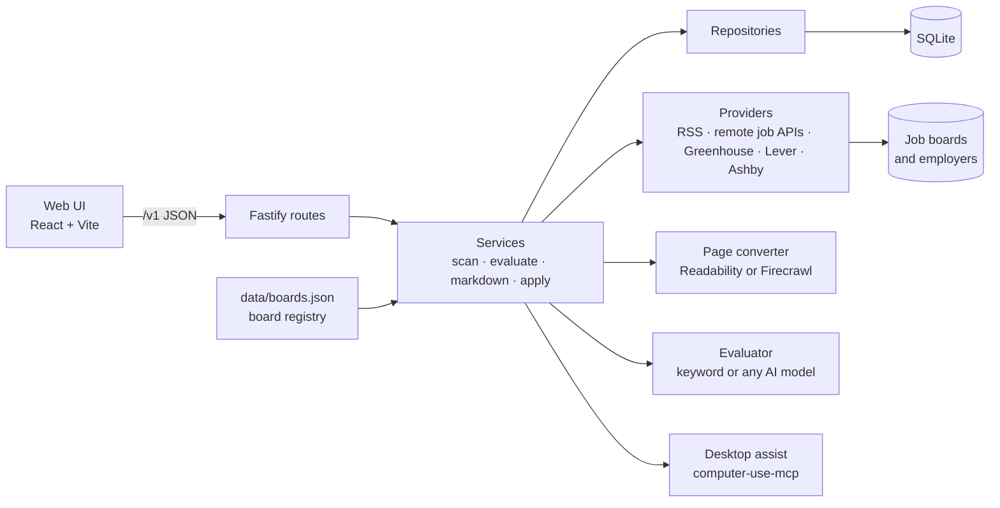

<p align="center">
  
</p>

<p align="center"><strong>Find work worth your while, across Africa.</strong></p>

KaziScout is a job-search agent that runs on your own computer. It scans African job boards,
scores every posting from 1 to 5 against your profile, turns cluttered job pages into clean
Markdown, and tracks your applications. You review each one and press Submit yourself.

"Kazi" is Swahili for work.


## What it does

|                                 |                                                                                                                                                                                                                                                                                                                                |
| ------------------------------- | ------------------------------------------------------------------------------------------------------------------------------------------------------------------------------------------------------------------------------------------------------------------------------------------------------------------------------ |
| **Scans African job boards**    | Reads 25 boards through their public RSS feeds and APIs: Kenya, Nigeria, Ghana, Zimbabwe, Zambia, Malawi, Botswana, the Gambia, francophone and pan-African boards, and remote boards filtered to roles open to Africa.                                                                                                        |
| **Reads employer career pages** | Reads 21 employers directly through the public APIs of their hiring systems (Greenhouse, Lever, Ashby): African employers such as M-KOPA, Moniepoint, Jumia, Andela and One Acre Fund, and remote-first companies filtered to roles open to Africa. Any employer on those systems, in any country, can be added with one line. |
| **Lists the rest**              | A directory of 118 checked sources covering 27 African countries plus pan-African and remote sources. Boards without a public feed are linked, never scraped. See [docs/BOARDS.md](docs/BOARDS.md).                                                                                                                            |
| **Scores each job 1 to 5**      | Offline keyword scoring on title, skills, location and freshness, with the reasons shown. Connect any AI model (OpenAI, Gemini, DeepSeek, Groq, OpenRouter, Claude, or a free local model through Ollama or LM Studio) and it writes a fuller assessment and a suggested opening paragraph.                                    |
| **Page to Markdown**            | Paste any job page and get clean Markdown for reading or for an AI model. Uses Mozilla Readability locally, or [Firecrawl](https://firecrawl.dev) when you add a key (which also renders JavaScript).                                                                                                                          |
| **Tracks applications**         | Saved, applied, interview, offer, rejected, withdrawn, with notes.                                                                                                                                                                                                                                                             |
| **Helps you apply**             | Builds an application pack (your details, matching skills, gaps to address) and copies it to your clipboard, through [computer-use-mcp](https://github.com/zavora-ai/computer-use-mcp) if you enable it.                                                                                                                       |

Everything is stored in one SQLite file on your machine. Nothing leaves it except the requests
you trigger: board scans, page fetches, and AI or Firecrawl calls if you configure them.


## Architecture



Routes handle HTTP only, services hold the rules, repositories hold the SQL. The board registry
is a JSON file in the repo, so adding a board is a pull request, not a database change. Decisions
are recorded in [docs/adr](docs/adr).

## Prerequisites

- Node.js 24 or newer (KaziScout uses the built-in `node:sqlite`)
- pnpm 11 (`corepack enable` provides it)

## Setup

```sh
git clone https://github.com/swiftkimani/kaziscout.git
cd kaziscout
pnpm install
cp .env.example .env   # optional: add API keys
```

## Run

Development, with live reload (API on 8787, UI on 5173):

```sh
pnpm dev
```

Production, one process serving both:

```sh
pnpm build
pnpm start             # http://127.0.0.1:8787
```

Then:

1. Open **Boards** or **Jobs** and choose **Scan all boards**.
2. Fill in **Profile**. Every job is scored as soon as you save.
3. Sort **Jobs** by best fit, open one, and save it to your tracker.

## Test

```sh
pnpm test          # 81 server tests; no network needed
pnpm typecheck
pnpm lint
pnpm format:check
```

## Configuration

All settings are optional. See [.env.example](.env.example).

| Variable                 | Default                  | Purpose                                                                                         |
| ------------------------ | ------------------------ | ----------------------------------------------------------------------------------------------- |
| `PORT`                   | `8787`                   | Port the server listens on                                                                      |
| `HOST`                   | `127.0.0.1`              | Interface to bind. Keep it local; there is no login.                                            |
| `LOG_LEVEL`              | `info`                   | `debug`, `info`, `warn`, `error` or `silent`                                                    |
| `DATABASE_PATH`          | `./var/kaziscout.sqlite` | SQLite file, relative to `server/`                                                              |
| `FIRECRAWL_API_KEY`      | none                     | Convert pages with Firecrawl instead of the local converter                                     |
| `AI_BASE_URL`            | none                     | Base URL of any OpenAI-compatible server. Enables "Assess with AI".                             |
| `AI_API_KEY`             | none                     | Key for that server. Local servers such as Ollama need none.                                    |
| `AI_MODEL`               | none                     | Model name. Required with `AI_BASE_URL`.                                                        |
| `ANTHROPIC_API_KEY`      | none                     | Use Claude instead, when `AI_BASE_URL` is empty. `AI_MODEL` then defaults to `claude-opus-5-5`. |
| `DESKTOP_ASSIST_ENABLED` | `false`                  | Copy application packs through computer-use-mcp                                                 |

## API

The UI is a client of a small versioned API, which you can also call directly.

| Method and path                                                          | Purpose                                                                                           |
| ------------------------------------------------------------------------ | ------------------------------------------------------------------------------------------------- |
| `GET /v1/boards`                                                         | Board directory with last scan result and job counts                                              |
| `POST /v1/scans`                                                         | Scan every board that has a public feed                                                           |
| `POST /v1/boards/:id/scan`                                               | Scan one board                                                                                    |
| `GET /v1/jobs`                                                           | List jobs. Filters: `search`, `board`, `country`, `remote`, `minScore`, `sort`, `limit`, `cursor` |
| `GET /v1/jobs/:id`                                                       | One job with its evaluation and tracker entry                                                     |
| `POST /v1/jobs/:id/evaluate`                                             | Score a job. Body: `{"evaluator": "heuristic" \| "ai"}`                                           |
| `POST /v1/jobs/:id/markdown`                                             | Replace the job's description with its full posting page                                          |
| `GET /v1/jobs/:id/application-pack`                                      | The text pack for applying                                                                        |
| `POST /v1/jobs/:id/assist`                                               | Copy the pack to the clipboard through computer-use-mcp                                           |
| `POST /v1/extract`                                                       | Convert any public page to Markdown. Body: `{"url": "..."}`                                       |
| `GET` / `PUT /v1/profile`                                                | Read or save the profile                                                                          |
| `GET` / `POST /v1/applications`, `PATCH` / `DELETE /v1/applications/:id` | The tracker                                                                                       |
| `GET /health`                                                            | Liveness check                                                                                    |

Errors use one envelope:
`{"error": {"code": "NOT_FOUND", "message": "...", "details": {}, "request_id": "..."}}`.

## Using KaziScout with an AI agent

KaziScout prepares; an agent with desktop control can do the typing. Connect
[computer-use-mcp](https://github.com/zavora-ai/computer-use-mcp) to your agent (Claude Code,
OpenCode, Codex and others), start KaziScout, and point the agent at
[skills/kaziscout-apply/SKILL.md](skills/kaziscout-apply/SKILL.md). The skill tells the agent to
fetch the application pack from the API, fill in the form through the accessibility tools, and
stop before Submit so you can check it.

## Project structure

```
server/
  data/boards.json      board registry (source of truth for boards)
  src/boards/           registry loader, country detection, board verifier
  src/providers/        one reader per kind of source (RSS, remote job APIs, hiring systems)
  src/extract/          page to Markdown, Firecrawl client, URL safety check
  src/scoring/          keyword scorer and AI evaluators (OpenAI-compatible, Claude)
  src/repositories/     SQL
  src/services/         scan, evaluation, markdown, apply
  src/routes/           HTTP handlers and request schemas
  src/db/               SQLite client and migrations
  test/                 tests and recorded feed fixtures
web/
  src/components/ui/    primitives (the only place raw styling lives)
  src/features/         jobs, boards, tracker, profile, extract
  src/styles/tokens.css design tokens
brand/                  logo and brand notes
docs/                   board list, decisions, handoff journal
skills/                 agent guide for assisted applications
```

## Adding a job board

1. Add an entry to `server/data/boards.json`. Use `"access": {"type": "rss", "feedUrl": "..."}`
   if the board has a feed, or `{"type": "listing"}` if it does not. For an employer that
   hires through Greenhouse, Lever or Ashby, use
   `{"type": "ats", "provider": "greenhouse", "slug": "<name in its careers URL>"}`.
2. Run `pnpm boards:verify`. It checks every board and regenerates `docs/BOARDS.md`.
3. Open a pull request.

Only add boards that publish a feed or API meant for reuse. KaziScout does not scrape HTML
listings or sources that need a login.

## Troubleshooting

| Problem                                         | What to do                                                                                                                                      |
| ----------------------------------------------- | ----------------------------------------------------------------------------------------------------------------------------------------------- |
| `No such built-in module: node:sqlite`          | Upgrade to Node.js 24 or newer.                                                                                                                 |
| A board shows "Last scan failed"                | Boards time out now and then. Scan it again; if it keeps failing, run `pnpm boards:verify`.                                                     |
| Page to Markdown returns "no readable text"     | The page is drawn by JavaScript. Add `FIRECRAWL_API_KEY`.                                                                                       |
| "That address can't be fetched"                 | Only public http and https pages are fetched; local and private addresses are refused on purpose.                                               |
| Jobs show a dash instead of a score             | Save your profile. Scores need something to compare against.                                                                                    |
| "returned an assessment that could not be read" | The model did not produce valid JSON. Small local models do this; try a larger one.                                                             |
| Desktop assist fails on macOS                   | Grant your terminal Accessibility permission, as [computer-use-mcp describes](https://github.com/zavora-ai/computer-use-mcp#set-up-your-agent). |

## Limits, stated plainly

- The keyword score is a filter, not a judgement. It cannot tell "5 years required" from
  "5 years preferred". Use it to rank, then read the posting.
- Board feeds carry what the board chooses to publish: often the latest 10 to 50 postings, and
  some feeds mix in career articles.
- Remote-first employers are filtered by the location text on each role. A role marked only
  "Remote" is kept, even though some of those turn out to be limited to one country.
- AI assessment quality depends on the model. It was run live against a 1.5B local model, which
  handled short postings and failed on long ones. Use a 7B or larger local model, or a hosted one.
- career-ops reads about 110 kinds of source. KaziScout has the three most common hiring
  systems, RSS and three remote job APIs; the rest are not ported.
- KaziScout never submits an application. That is deliberate.

## Credits

Created by **Benard Kimani** ([@swiftkimani](https://github.com/swiftkimani)).

KaziScout builds on two open-source projects, with thanks to their authors:

- [computer-use-mcp](https://github.com/zavora-ai/computer-use-mcp) by **James Karanja Maina**
  (Zavora Technologies Ltd), used as a dependency for desktop control.
- [career-ops](https://github.com/career-ops-hq/career-ops) by
  **Santiago Fernández de Valderrama**, the design reference for local, human-in-the-loop job
  search and for reading employers through their hiring systems.

Full acknowledgements, including data sources, are in [CREDITS.md](CREDITS.md).

## Contributing

Read [AGENTS.md](AGENTS.md) for the project rules and [docs/CONTEXT.md](docs/CONTEXT.md) for the
current state of the work. Commits follow Conventional Commits.

## Licence

[AGPL-3.0-or-later](LICENSE) © 2026 Benard Kimani. In short: you can use, change and share
KaziScout freely, and if you run a changed version as a service for other people you must publish
your changes under the same licence. See [NOTICE](NOTICE) for the licence history and commercial
licensing.
