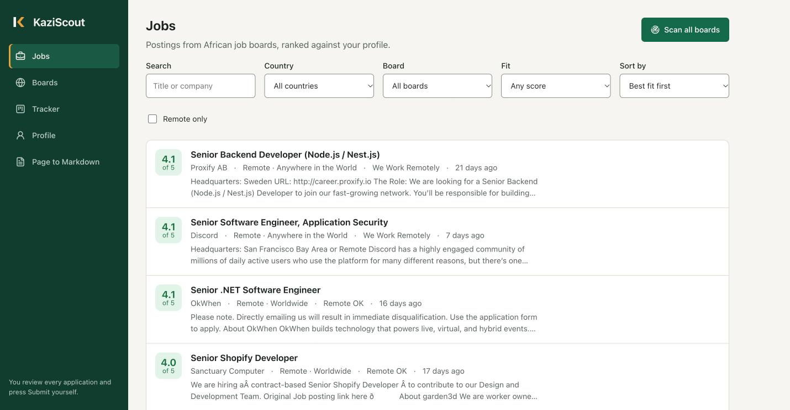
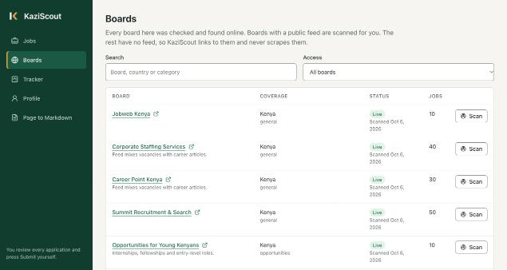
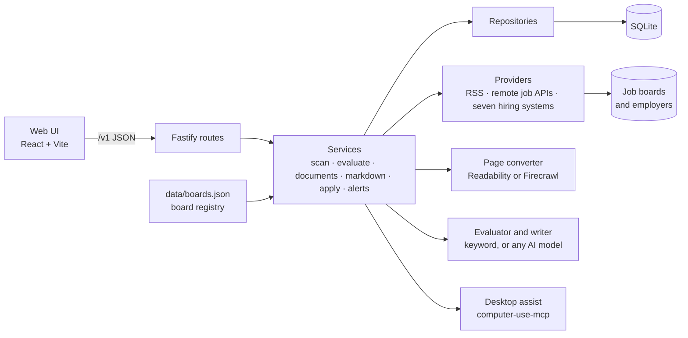

<p align="center">
  
</p>

<p align="center"><strong>Find work worth your while, across Africa.</strong></p>

KaziScout is a job-search agent that runs on your own computer. It reads job boards and employer
career pages, deepest in Africa and usable from any country, scores every posting from 1 to 5
against your profile, turns cluttered job pages into clean Markdown, and tracks your applications.
Use it in the browser, in the terminal, or through an AI coding tool. You review each application
and press Submit yourself.

"Kazi" is Swahili for work.



## What it does

|                                        |                                                                                                                                                                                                                                                                                                                                                                                                       |
| -------------------------------------- | ----------------------------------------------------------------------------------------------------------------------------------------------------------------------------------------------------------------------------------------------------------------------------------------------------------------------------------------------------------------------------------------------------- |
| **Scans job boards**                   | Reads 25 boards through their public RSS feeds and APIs: Kenya, Nigeria, Ghana, Zimbabwe, Zambia, Malawi, Botswana, the Gambia, francophone and pan-African boards, and worldwide remote boards.                                                                                                                                                                                                      |
| **Reads employer career pages**        | Reads 35 employers directly through the public APIs of seven hiring systems (Greenhouse, Lever, Ashby, SmartRecruiters, Workable, Workday, Recruitee) and Teamtailor career feeds: African employers such as M-KOPA, Moniepoint, Jumia, Paystack, Kuda, Absa, Andela and One Acre Fund, and employers that hire worldwide. Any employer on those systems, in any country, can be added with one line. |
| **Lists the rest**                     | A directory of 131 checked sources. Boards without a public feed are linked, never scraped. See [docs/BOARDS.md](docs/BOARDS.md).                                                                                                                                                                                                                                                                     |
| **Works for any country**              | Your profile can name any of 234 countries. Africa is where the board list is deepest, but jobs anywhere are detected, filtered and scored.                                                                                                                                                                                                                                                           |
| **Sets itself up from your CV**        | Give it your CV as a PDF, Word, text or Markdown file, or copy the text. It fills in your name, contact details, headline, skills and country, then asks follow-up questions about what the CV does not say: the roles you want, where you can work, whether remote suits you. Nothing is saved until you confirm.                                                                                    |
| **Scores each job 1 to 5**             | Offline keyword scoring on title, skills, location and freshness, with the reasons shown. A remote role's region limit ("EMEA", "US only", "LATAM") is judged against your countries, including limits stated only in the posting text, and a job you cannot take because of where it is never scores above 2.                                                                                        |
| **Works with any AI model**            | Connect OpenAI, Gemini, DeepSeek, Groq, OpenRouter, Claude, or a free local model through Ollama or LM Studio, and it writes a fuller assessment. With no model at all, everything else still works.                                                                                                                                                                                                  |
| **Writes your documents**              | With a model connected, writes a cover letter and a CV tailored to the posting from your own CV, under a strict "reword, never invent" rule, and opens each on a clean page to print or save as PDF.                                                                                                                                                                                                  |
| **Page to Markdown**                   | Paste any job page and get clean Markdown for reading or for an AI model. Uses Mozilla Readability locally, or [Firecrawl](https://firecrawl.dev) when you add a key (which also renders JavaScript).                                                                                                                                                                                                 |
| **Scans on a schedule and alerts you** | Optionally re-scans every so often and posts new strong matches to a webhook (Slack, Discord, ntfy, Zapier, n8n).                                                                                                                                                                                                                                                                                     |
| **Tracks applications**                | Saved, applied, interview, offer, rejected, withdrawn, with notes.                                                                                                                                                                                                                                                                                                                                    |
| **Helps you apply**                    | Builds an application pack (your contact details, matching skills, gaps to address) and copies it to your clipboard, through [computer-use-mcp](https://github.com/zavora-ai/computer-use-mcp) if you enable it. A practice form at `/practice-form` lets you or an AI agent rehearse first.                                                                                                          |
| **Works in the terminal**              | Talk to it through an AI coding tool (Claude Code, OpenCode, Codex), which assesses jobs with its own model, or run `./kazi scan`, `./kazi jobs`, `./kazi show <id>` yourself.                                                                                                                                                                                                                        |
| **Can be put behind a sign-in**        | Set an access token and the app and API require it, so you can run it on a home server or VPS. It is single-owner, not multi-user.                                                                                                                                                                                                                                                                    |

Everything is stored in one SQLite file on your machine. Nothing leaves it except the requests
you trigger: board scans, page fetches, and AI or Firecrawl calls if you configure them.



## Architecture



Routes handle HTTP only, services hold the rules, repositories hold the SQL. The board registry
is a JSON file in the repo, so adding a board is a pull request, not a database change. Decisions
are recorded in [docs/adr](docs/adr).

## Prerequisites

- Node.js 24 or newer (KaziScout uses the built-in `node:sqlite`)
- pnpm 11 (`corepack enable` provides it)

## Setup

```sh
git clone https://github.com/swiftkimani/kaziscout.git
cd kaziscout
pnpm install
cp .env.example .env   # optional: add API keys
```

## Run

Development, with live reload (API on 8787, UI on 5173):

```sh
pnpm dev
```

Production, one process serving both:

```sh
pnpm build
pnpm start             # http://127.0.0.1:8787
```

Then:

1. Open **Profile**, choose **Choose CV file**, answer the follow-up questions and save.
2. Open **Jobs** and choose **Scan all boards**. Every job is scored against your profile.
3. Sort **Jobs** by best fit, open one, and save it to your tracker.

`pnpm dev` turns on desktop assist, which uses
[computer-use-mcp](https://github.com/zavora-ai/computer-use-mcp) to read a CV you have copied and
to copy application packs to your clipboard. Set `DESKTOP_ASSIST_ENABLED=false` to switch it off.
`pnpm start` leaves it off unless you turn it on.

## Use it in the terminal

There are two ways, and they share one database with the web app.

### With an AI coding tool, the way career-ops is used

Open the repository in Claude Code, OpenCode, Codex or another AI coding tool and talk to it:

> scan the boards and show me my best matches
>
> evaluate this one: https://careers.example.com/jobs/frontend-developer
>
> write me a cover letter for it

The tool reads [skills/kaziscout/SKILL.md](skills/kaziscout/SKILL.md), runs the `./kazi` commands
for you, and judges each job against your CV **using whatever model that tool runs on**. KaziScout
needs no AI key of its own for this. In Claude Code and OpenCode the skill is also available as
`/kaziscout`.

### Directly

```sh
./kazi cv ~/Documents/cv.pdf   # set up your profile from your CV; asks follow-up questions
./kazi profile --roles "Frontend Developer, Full-Stack Developer"   # change any answer later
./kazi scan                 # read every source (about a minute)
./kazi jobs --min 4         # your strongest matches
./kazi jobs --country KE --newest
./kazi add https://...      # add a job you found yourself, and score it
./kazi show <ID>            # fit, reasons, link and description
./kazi track <ID>           # save it to your tracker
./kazi md https://...       # any web page as clean Markdown
./kazi help
```

## Test

```sh
pnpm test          # 195 server tests and 43 web tests; no network needed
pnpm typecheck
pnpm lint
pnpm format:check
```

## Configuration

All settings are optional. See [.env.example](.env.example).

| Variable                 | Default                           | Purpose                                                                                         |
| ------------------------ | --------------------------------- | ----------------------------------------------------------------------------------------------- |
| `PORT`                   | `8787`                            | Port the server listens on                                                                      |
| `HOST`                   | `127.0.0.1`                       | Interface to bind. Anything else requires `ACCESS_TOKEN`.                                       |
| `LOG_LEVEL`              | `info`                            | `debug`, `info`, `warn`, `error` or `silent`                                                    |
| `DATABASE_PATH`          | `./var/kaziscout.sqlite`          | SQLite file, relative to `server/`                                                              |
| `ACCESS_TOKEN`           | none                              | Sign-in token. Required before listening beyond this computer.                                  |
| `SCAN_INTERVAL_MINUTES`  | `0`                               | Minutes between automatic scans. `0` is off; minimum 15.                                        |
| `ALERT_WEBHOOK_URL`      | none                              | Where to post new strong matches after a scheduled scan.                                        |
| `ALERT_MIN_SCORE`        | `4`                               | Lowest score that triggers an alert.                                                            |
| `FIRECRAWL_API_KEY`      | none                              | Convert pages with Firecrawl instead of the local converter                                     |
| `AI_BASE_URL`            | none                              | Base URL of any OpenAI-compatible server. Enables "Assess with AI".                             |
| `AI_API_KEY`             | none                              | Key for that server. Local servers such as Ollama need none.                                    |
| `AI_MODEL`               | none                              | Model name. Required with `AI_BASE_URL`.                                                        |
| `ANTHROPIC_API_KEY`      | none                              | Use Claude instead, when `AI_BASE_URL` is empty. `AI_MODEL` then defaults to `claude-opus-5-5`. |
| `DESKTOP_ASSIST_ENABLED` | `false` (`true` under `pnpm dev`) | Use computer-use-mcp for the clipboard: reading a copied CV and copying application packs       |

## API

The UI is a client of a small versioned API, which you can also call directly.

| Method and path                                                          | Purpose                                                                                                |
| ------------------------------------------------------------------------ | ------------------------------------------------------------------------------------------------------ |
| `GET /v1/boards`                                                         | Board directory with last scan result and job counts                                                   |
| `POST /v1/scans`                                                         | Scan every board that has a public feed                                                                |
| `POST /v1/boards/:id/scan`                                               | Scan one board                                                                                         |
| `GET /v1/jobs`                                                           | List jobs. Filters: `search`, `board`, `country`, `remote`, `minScore`, `sort`, `limit`, `cursor`      |
| `POST /v1/jobs`                                                          | Add a job from its posting link. Body: `{"url": "..."}`                                                |
| `GET /v1/jobs/:id`                                                       | One job with its evaluation and tracker entry                                                          |
| `POST /v1/jobs/:id/evaluate`                                             | Score a job. Body: `{"evaluator": "heuristic" \| "ai"}`                                                |
| `PUT /v1/jobs/:id/evaluation`                                            | Store an assessment made outside KaziScout, for example by an AI coding tool                           |
| `POST /v1/jobs/:id/markdown`                                             | Replace the job's description with its full posting page                                               |
| `GET /v1/jobs/:id/application-pack`                                      | The text pack for applying                                                                             |
| `GET` / `POST /v1/jobs/:id/documents`                                    | Read, or have the AI model write, the cover letter and tailored CV                                     |
| `POST /v1/jobs/:id/assist`                                               | Copy the pack to the clipboard through computer-use-mcp                                                |
| `POST /v1/extract`                                                       | Convert any public page to Markdown. Body: `{"url": "..."}`                                            |
| `GET` / `PUT /v1/profile`                                                | Read or save the profile                                                                               |
| `POST /v1/profile/import`                                                | Draft a profile from a CV file, pasted text or the clipboard, with follow-up questions. Saves nothing. |
| `GET` / `POST /v1/applications`, `PATCH` / `DELETE /v1/applications/:id` | The tracker                                                                                            |
| `GET` / `POST` / `DELETE /v1/session`                                    | Sign-in state, sign in with the access token, sign out                                                 |
| `GET /health`                                                            | Liveness check                                                                                         |

Errors use one envelope:
`{"error": {"code": "NOT_FOUND", "message": "...", "details": {}, "request_id": "..."}}`.

## Using KaziScout with an AI agent

KaziScout prepares; an agent with desktop control can do the typing. Connect
[computer-use-mcp](https://github.com/zavora-ai/computer-use-mcp) to your agent (Claude Code,
OpenCode, Codex and others), start KaziScout, and point the agent at
[skills/kaziscout-apply/SKILL.md](skills/kaziscout-apply/SKILL.md). The skill tells the agent to
fetch the application pack from the API, fill in the form, and stop before Submit so you can
check it. For web forms the agent needs a browser tool (Claude in Chrome, Playwright MCP);
computer-use covers native desktop apps. Rehearse on the built-in practice form at
`/practice-form` first.

## Project structure

```
server/
  data/boards.json      board registry (source of truth for boards)
  src/boards/           registry loader, country detection, board verifier
  src/providers/        one reader per kind of source (RSS, remote job APIs, hiring systems)
  src/extract/          page to Markdown, Firecrawl client, URL safety check
  src/ai/               one client per kind of model server (OpenAI-compatible, Claude)
  src/auth/             optional access-token sign-in
  src/scoring/          keyword scorer, AI assessment, country and remote-region rules
  src/repositories/     SQL
  src/services/         scan, scheduler, alerts, evaluation, documents, markdown, apply
  src/routes/           HTTP handlers and request schemas
  src/cli/              the ./kazi terminal commands
  src/db/               SQLite client and migrations
  test/                 tests and recorded feed fixtures
web/
  src/components/ui/    primitives (the only place raw styling lives)
  src/features/         jobs, boards, tracker, profile, extract, practice form
  src/styles/tokens.css design tokens
brand/                  logo and brand notes
docs/                   board list, decisions, handoff journal
skills/                 guides for AI tools: running a job search, and assisted applications
```

## Adding a job board

1. Add an entry to `server/data/boards.json`. Use `"access": {"type": "rss", "feedUrl": "..."}`
   if the board has a feed, or `{"type": "listing"}` if it does not. For an employer that
   hires through Greenhouse, Lever, Ashby, SmartRecruiters, Workable or Recruitee, use
   `{"type": "ats", "provider": "greenhouse", "slug": "<name in its careers URL>"}`.
2. Run `pnpm boards:verify`. It checks every board and regenerates `docs/BOARDS.md`.
3. Open a pull request.

Only add boards that publish a feed or API meant for reuse. KaziScout does not scrape HTML
listings or sources that need a login.

## Troubleshooting

| Problem                                               | What to do                                                                                                                                      |
| ----------------------------------------------------- | ----------------------------------------------------------------------------------------------------------------------------------------------- |
| `No such built-in module: node:sqlite`                | Upgrade to Node.js 24 or newer.                                                                                                                 |
| A board shows "Last scan failed"                      | Boards time out now and then. Scan it again; if it keeps failing, run `pnpm boards:verify`.                                                     |
| Page to Markdown returns "no readable text"           | The page is drawn by JavaScript. Add `FIRECRAWL_API_KEY`.                                                                                       |
| "That address can't be fetched"                       | Only public http and https pages are fetched; local and private addresses are refused on purpose.                                               |
| Jobs show a dash instead of a score                   | Save your profile. Scores need something to compare against.                                                                                    |
| "returned an assessment that could not be read"       | The model did not produce valid JSON. Small local models do this; try a larger one.                                                             |
| The server refuses to start with "Refusing to listen" | You set `HOST` to something other than `127.0.0.1` without an `ACCESS_TOKEN`. Set a token of 16 or more characters.                             |
| Desktop assist fails on macOS                         | Grant your terminal Accessibility permission, as [computer-use-mcp describes](https://github.com/zavora-ai/computer-use-mcp#set-up-your-agent). |

## Limits, stated plainly

- The keyword score is a filter, not a judgement. It cannot tell "5 years required" from
  "5 years preferred". Use it to rank, then read the posting.
- Board feeds carry what the board chooses to publish: often the latest 10 to 50 postings, and
  some feeds mix in career articles.
- A role marked only "Remote" is checked for a stated limit in its text, such as "must be based
  in the United States". If the posting says nothing, it is treated as open to everyone, and some
  of those still turn out to be limited.
- AI assessment quality depends on the model. It was run live against a 1.5B local model, which
  handled short postings and failed on long ones. Use a 7B or larger local model, or a hosted one.
- career-ops reads about 110 kinds of source. KaziScout reads eleven (RSS, Teamtailor feeds,
  three remote job APIs and seven hiring systems). Personio was tried and left out: no real
  employer could be found to verify it against. Workday and SmartRecruiters list roles without
  descriptions, and Workday only its 20 newest.
- Desktop accessibility tools cannot see web form fields in Chrome-family browsers, so an AI
  agent filling a web application form needs a browser tool. See the agent skill.
- AI-written documents are only as good as the model. A 1.5B local model produced a cover
  letter that was fluent and wrong. Read every document against your real CV before sending.
- Sign-in is one shared access token for one owner. There are no user accounts.
- Without an AI model, the CV is read by fixed rules: they find a name, contact details, a
  headline, a country and a skills section, and nothing subtler. A scanned PDF has no text to read.
- Computer use here means the clipboard. It does not open a file picker or read your screen.
- KaziScout never submits an application. That is deliberate.

## Credits

Created by **Benard Kimani** ([@swiftkimani](https://github.com/swiftkimani)).

KaziScout builds on two open-source projects, with thanks to their authors:

- [computer-use-mcp](https://github.com/zavora-ai/computer-use-mcp) by **James Karanja Maina**
  (Zavora Technologies Ltd), used as a dependency for desktop control.
- [career-ops](https://github.com/career-ops-hq/career-ops) by
  **Santiago Fernández de Valderrama**, the design reference for local, human-in-the-loop job
  search and for reading employers through their hiring systems.

Full acknowledgements, including data sources, are in [CREDITS.md](CREDITS.md).

## Contributing

Pull requests go to the `dev` branch; `main` is only updated from `dev`. See
[CONTRIBUTING.md](CONTRIBUTING.md) for the branch flow, [AGENTS.md](AGENTS.md) for the project
rules and [docs/CONTEXT.md](docs/CONTEXT.md) for the current state of the work.

## Licence

[AGPL-3.0-or-later](LICENSE) © 2026 Benard Kimani. In short: you can use, change and share
KaziScout freely, and if you run a changed version as a service for other people you must publish
your changes under the same licence. See [NOTICE](NOTICE) for the licence history and commercial
licensing.
